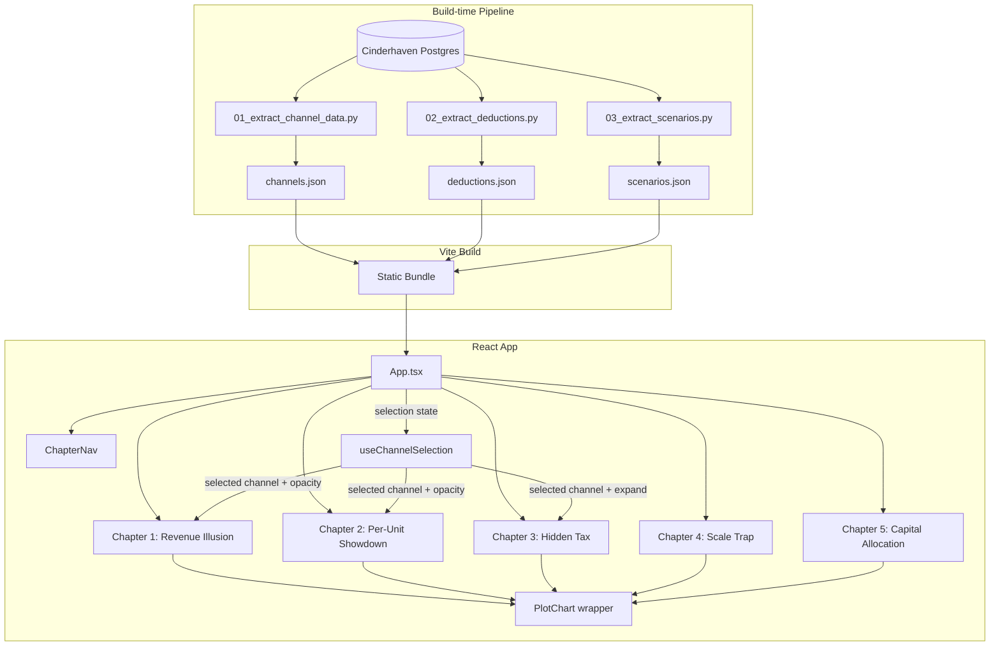

# feat: Build channel profitability interactive experience

## Summary

The plan builds a root-level Vite+React+TS project with Observable Plot charts, a Python data pipeline from Cinderhaven Postgres producing per-domain JSON files bundled as static imports, and per-chapter component directories styled with Lailara Design System v2 CSS custom properties. Channel selection state lives in React and drives Plot re-renders with opacity dimming for click-to-pin interactivity.

---

## Problem Frame

CFOs at $25M specialty food brands misallocate growth capital because every report they see ranks channels by revenue, not contribution. This piece makes the counter-argument with Cinderhaven's actual data in a form a skeptical CFO can explore and bring to a board conversation. (See origin: `docs/brainstorms/channel-profitability-requirements.md` for the full problem statement.)

---

## Requirements

- R1. All five chapters (1–4, 5) render with real Cinderhaven data — no placeholder values
- R2. All charts render on first paint — no loading states visible to the user
- R3. Offline-capable: page works after initial load with no network connection
- R4. Channel click-to-explore works across all chart types that support it (bar charts in Ch. 1–3)
- R5. Chapter 1 three-way toggle works with legible visual transition
- R6. Lailara Design System v2 applied throughout: canvas, typography, palette, chart rules
- R7. Fonts self-hosted — no external CDN calls
- R8. Hosted at a URL that can be sent in an email
- R9. A skeptical CFO could receive this link and take it seriously
- R10. Pipeline data reconciles: all channel totals match platform-level revenue
- R11. Channels with < 5 orders or < $10K revenue excluded from charts (noise suppression)

---

## Scope Boundaries

- Chapter 5 (Subscription Overlay) — subscription data does not exist; deferred to v2
- PDF boardroom export — v2
- Excel financial model as standalone deliverable — evaluate after core story
- Jupyter methodology notebook — evaluate after core story
- Mobile optimization — desktop-first; not broken on mobile but not designed for it
- "Plug in your numbers" / scenario inputs — v2
- Email gating or lead capture — no CTA in v1
- Live Postgres connection — all data baked at build time
- Keyboard chart navigation — accessibility enhancement for follow-up
- Animated chart transitions — Observable Plot does not support them; CSS crossfade is sufficient

---

## Context & Research

### Relevant Code and Patterns

- **retailer-deduction-recovery** (sibling project): React 19 + Vite + D3, `frontend/` subdirectory with own `package.json`, feature directories under `src/` (sankey/, cohort/, explorer/), ChapterNav component, CSS custom properties for Lailara tokens in `App.css`, Vitest + Testing Library + jsdom, numbered Python scripts (`20_export_json.py`), `@fontsource` packages for self-hosted fonts
- **channel-profitability-analysis** (predecessor project): Astro + React/D3 static narrative, same analysis with different stack. Key architectural decisions carry forward (see Institutional Learnings)

### Institutional Learnings

- **Prose-data validation is critical.** The predecessor had 33 broken prose claims after a data scale-up. Build `tests/test_prose_data.py` alongside the first JSON generation script. Every numeric claim rendered by a React component should have a tolerance-based assertion (0.005 for percentages, 0.01–0.03 for dollars). (Source: `channel-profitability-analysis/docs/solutions/`)
- **Single tokens file prevents color drift.** A sibling project caught hex drift (`#2e8b57` vs `#1E8C7E`) caused by inline definitions. Define all Lailara tokens once in CSS custom properties in `:root`. (Source: `product-data-health-audit/docs/solutions/`)
- **"Interactivity proves claims, not explores data."** Click-to-pin drill-downs let skeptics verify claims without free-form exploration that undermines narrative authority. No filters, sliders, or "explore your own view." (Source: predecessor DECISIONS.md)
- **Visual verification required after pipeline changes.** The predecessor's automated tests passed with a case mismatch (`"dtc"` vs `"DTC"`) that produced empty charts. Pipeline tests confirm numbers; they cannot confirm rendering. (Source: predecessor DECISIONS.md)
- **Algebraic reduction check for metrics.** Any formula of the form `a / (a / b)` always returns `b` regardless of data. Simplify every formula during development. Use input perturbation testing. (Source: `trade-spend-data-diagnostic/docs/solutions/`)
- **Embed snapshot constants in generation scripts.** The predecessor pattern: script runs in snapshot mode (no DB required) or live mode. CI and local dev work without a Postgres connection. (Source: predecessor architecture)

### External References

- Observable Plot React integration: `useRef` + `useEffect` pattern; library returns raw DOM elements, destroy/rebuild on every render. No incremental updates. (Source: Observable Plot docs)
- Observable Plot waterfall charts: use `Plot.barY` with explicit `y1`/`y2` channels, pre-compute cumulative positions. No native waterfall mark. (Source: Observable Plot bar mark docs)
- Observable Plot interactivity: `tip` mark for tooltips, `pointer` transform for hover. Click-to-select is not a native API — manage selection in React state, re-render with opacity per datum. (Source: Observable Plot interactions docs, GitHub issue #1832)
- Observable Plot does not support animated transitions. CSS crossfade on the container div is the pragmatic approach. (Source: Observable Plot docs)
- Fontsource for self-hosted fonts: `@fontsource-variable/playfair-display` and `@fontsource/source-sans-3` packages bundle woff2 files with `@font-face` declarations. (Source: fontsource.org)
- Vite JSON imports are inlined into the JS bundle at build time. Split by domain to manage bundle size. (Source: Vite docs)
- SVG accessibility: `role="img"` with `aria-labelledby` pointing to `<title>` and `<desc>`, hidden data tables as parallel representation for screen readers. (Source: W3C SVG Accessibility wiki)

---

## Key Technical Decisions

- **Root-level Vite project, no `frontend/` subdirectory.** The sibling project uses `frontend/` because it has a separate backend. This project is purely static — no backend, no API. A root-level Vite project is simpler and avoids unnecessary nesting. Python scripts live in `scripts/` at root.
- **Observable Plot rendered via useRef/useEffect with destroy/rebuild.** Plot returns DOM elements, not React elements. Each chart component mounts the Plot SVG into a ref container and removes it on cleanup or data change. React state (selected channel, active view) drives re-renders. This is the officially documented pattern.
- **CSS crossfade for Chapter 1 toggle transitions.** Observable Plot cannot animate between datasets. The container div fades out (opacity 0, 200ms), the Plot rebuilds with new data, then fades in (opacity 1, 200ms). `prefers-reduced-motion` snaps to final value.
- **Chapter 3: summary bar chart with click-to-expand waterfall.** Showing all 6 channel waterfalls simultaneously is visually overwhelming. Instead: a ranked summary bar shows per-channel contribution, clicking a channel expands its deduction waterfall below the summary, with DTC shown alongside for comparison. Click again to collapse.
- **Chapter numbering: 1–5, no gap.** The original Chapter 6 becomes Chapter 5 in the UI. The deferred subscription chapter is invisible to the CFO — a jump from 4 to 6 signals incompleteness.
- **Selection state clears on chapter change.** Each chapter has different chart types and data shapes. Carrying a channel selection across chapters would require mapping between incompatible visualizations. Clear and let the CFO re-select in each chapter's context.
- **JSON data split by domain, not by chapter.** Files like `channels.json`, `deductions.json`, `scenarios.json` are reusable across chapters. Vite tree-shakes unused imports. This avoids data duplication (channel names appear in every chapter).

---

## Open Questions

### Resolved During Planning

- **Chapter 3 waterfall presentation:** Summary bar + click-to-expand waterfall (not 6 simultaneous waterfalls). Resolved based on flow analysis — 6 waterfalls on one screen overwhelms a non-analytical audience.
- **Chapter 4 line chart interaction:** Hover-only tooltip showing marginal contribution at a given volume point. No click-to-pin on curves — there is no discrete element to "select" on a continuous line.
- **Chapter 5 (née 6) chart format:** Side-by-side grouped bars showing projected incremental contribution for the two scenarios ($1M retail vs $1M DTC), with a text callout for the delta.
- **"Click elsewhere" boundary:** Clicking anywhere outside chart marks (chart background, prose, nav) clears the selection. Implemented as a click handler on the chart container that checks if the click target is a mark element.

### Deferred to Implementation

- **Does `dim_channels` exist in Cinderhaven Postgres?** If not, channel tagging may need to be inferred from retailer IDs. Verify in U2 pipeline build; scope back if the schema differs from expectations.
- **Does the platform have the full deduction taxonomy for Ch. 3 waterfalls (slotting, trade spend, MCB, swell, OTIF)?** Verify in U2; scope back Ch. 3 waterfall detail if partial.
- **Cinderhaven channel mix percentages vs. brief's working assumptions.** Brief figures are placeholders; actual platform data determines the charts.
- **Chapter 5 scenario inputs — Cinderhaven's actual figures or representative industry assumptions?** Decide during U9 implementation based on what the data supports.
- **Hosting domain — subdomain off portfolio, or standalone?** Decide before launch, does not affect build.

---

## Output Structure

```
where-the-money-comes-from/
├── scripts/
│   ├── 01_extract_channel_data.py
│   ├── 02_extract_deductions.py
│   ├── 03_extract_scenarios.py
│   └── requirements.txt
├── src/
│   ├── data/
│   │   ├── channels.json
│   │   ├── deductions.json
│   │   └── scenarios.json
│   ├── chapters/
│   │   ├── Chapter1/
│   │   ├── Chapter2/
│   │   ├── Chapter3/
│   │   ├── Chapter4/
│   │   └── Chapter5/
│   ├── components/
│   │   ├── ChapterNav.tsx
│   │   ├── PlotChart.tsx
│   │   └── ChapterLayout.tsx
│   ├── hooks/
│   │   └── useChannelSelection.ts
│   ├── utils/
│   │   └── format.ts
│   ├── tokens.css
│   ├── App.tsx
│   ├── App.css
│   └── main.tsx
├── tests/
│   └── test_prose_data.py
├── index.html
├── package.json
├── tsconfig.json
├── tsconfig.app.json
├── tsconfig.node.json
├── vite.config.ts
└── netlify.toml
```

---

## High-Level Technical Design

> *This illustrates the intended approach and is directional guidance for review, not implementation specification. The implementing agent should treat it as context, not code to reproduce.*



**Data flow:** Python scripts extract from Postgres, shape into chart-ready JSON, write to `src/data/`. Vite bundles JSON as ES module imports. Each chapter component imports the JSON it needs, passes data + selection state to PlotChart wrapper, which mounts Observable Plot SVG via useRef/useEffect.

**Selection model:** `useChannelSelection` hook manages `{ selected: string | null }`. Chapters 1–3 pass `selected` to their Plot render — selected channel gets full opacity, others dim to 0.25. Chapter 3 additionally uses `selected` to toggle waterfall expansion. Chapters 4–5 do not use channel selection (different interaction models). Selection clears on chapter change via a useEffect that watches the active chapter.

---

## Implementation Units

### U1. Project scaffolding and Lailara design tokens

**Goal:** Set up a working Vite + React 19 + TypeScript project with Lailara Design System v2 tokens, self-hosted fonts, and a minimal App shell rendering the canvas background.

**Requirements:** R6, R7

**Dependencies:** None

**Files:**
- Create: `package.json`, `tsconfig.json`, `tsconfig.app.json`, `tsconfig.node.json`, `vite.config.ts`, `index.html`
- Create: `src/main.tsx`, `src/App.tsx`, `src/App.css`
- Create: `src/tokens.css`
- Create: `.gitignore`

**Approach:**
- Initialize with `npm create vite@latest` (React + TypeScript template), then customize
- `tokens.css` defines all Lailara tokens as CSS custom properties in `:root` — canvas, London greyscale, Chicago blue, Hong Kong teal steps, brand red, typography stacks, layout tokens. Single source of truth; no hex values elsewhere
- Install `@fontsource-variable/playfair-display` and `@fontsource/source-sans-3` via npm. Import weight-specific CSS in `main.tsx`
- App shell renders a centered container on canvas background with placeholder heading to verify fonts and tokens

**Patterns to follow:**
- `retailer-deduction-recovery/frontend/` for tsconfig project references pattern (`tsconfig.app.json` + `tsconfig.node.json`)
- `retailer-deduction-recovery/frontend/src/App.css` for Lailara CSS custom property structure

**Test scenarios:**
- Happy path: `npm run dev` starts without errors, page renders with correct canvas background (`#f5f3ee`)
- Happy path: Playfair Display renders for heading text, Source Sans 3 for body text (visual verification)
- Edge case: No network requests to external font CDNs (verify in browser network tab)

**Verification:**
- Dev server starts, page loads with Lailara canvas background and correct fonts
- `tokens.css` is the only file containing Lailara hex values

---

### U2. Python data pipeline

**Goal:** Extract all data needed for Chapters 1–5 from Cinderhaven Postgres, shape it into chart-ready JSON, and write to `src/data/`. Includes reconciliation checks and snapshot mode for offline builds.

**Requirements:** R1, R2, R10, R11

**Dependencies:** None (can run in parallel with U1)

**Files:**
- Create: `scripts/requirements.txt`
- Create: `scripts/01_extract_channel_data.py`
- Create: `scripts/02_extract_deductions.py`
- Create: `scripts/03_extract_scenarios.py`
- Create: `src/data/channels.json`
- Create: `src/data/deductions.json`
- Create: `src/data/scenarios.json`
- Test: `tests/test_prose_data.py`

**Approach:**
- `requirements.txt`: `psycopg2-binary>=2.9`, `pandas>=2.0`
- Each script connects to Cinderhaven Postgres via `DATABASE_URL` env var, queries the relevant fact/dimension tables, transforms with pandas, outputs JSON
- `01_extract_channel_data.py`: queries `fct_orders` (+ `dim_channels` if it exists, otherwise infers channel from retailer). Outputs `channels.json` with per-channel: revenue, contribution_dollars, contribution_margin_pct, units_shipped, contribution_per_unit. Excludes channels with < 5 orders or < $10K revenue
- `02_extract_deductions.py`: queries `fct_deductions`, `fct_chargebacks`. Outputs `deductions.json` with per-channel waterfall steps: gross_revenue, slotting, chargebacks, trade_spend, swell, otif, net_revenue, cogs, contribution. DTC waterfall uses: gross, cac, fulfillment, payment_processing, returns, net, cogs, contribution
- `03_extract_scenarios.py`: derives $1M investment scenarios from per-unit contribution and volume assumptions. Outputs `scenarios.json`
- All scripts embed snapshot constants so they can produce valid JSON without a live DB connection (snapshot mode via `--snapshot` flag)
- Reconciliation: each script verifies channel totals reconcile to platform-level revenue within tolerance
- `tests/test_prose_data.py`: loads generated JSON, recomputes every numeric claim, asserts within tolerance (0.005 for percentages, 0.01–0.03 for dollar amounts). Algebraic reduction check: verify metrics actually change when input data changes

**Execution note:** Verify schema assumptions (dim_channels existence, deduction taxonomy completeness) before writing extraction queries. If schema differs from expectations, document the gap and adapt.

**Patterns to follow:**
- `retailer-deduction-recovery/scripts/` for numbered script pattern
- Predecessor's snapshot-constant embedding pattern

**Test scenarios:**
- Happy path: each script produces valid JSON with expected keys and non-empty arrays
- Happy path: `channels.json` channel totals sum to platform-level revenue within tolerance
- Happy path: `deductions.json` waterfall steps sum correctly (gross − deductions = net, net − COGS = contribution)
- Edge case: channels with < 5 orders or < $10K revenue are excluded
- Edge case: snapshot mode (`--snapshot`) produces valid JSON without DB connection
- Error path: script fails clearly with a descriptive message when `DATABASE_URL` is not set
- Integration: `test_prose_data.py` catches a deliberately perturbed value (change one channel's revenue, verify the test fails)

**Verification:**
- All three JSON files exist in `src/data/` with correct structure
- `test_prose_data.py` passes
- Snapshot mode produces consistent output without DB

---

### U3. Shared chart infrastructure

**Goal:** Build reusable PlotChart React wrapper, channel selection hook, and formatting utilities that all chapter components depend on.

**Requirements:** R4, R6

**Dependencies:** U1

**Files:**
- Create: `src/components/PlotChart.tsx`
- Create: `src/hooks/useChannelSelection.ts`
- Create: `src/utils/format.ts`
- Test: `src/components/PlotChart.test.tsx`
- Test: `src/utils/format.test.ts`

**Approach:**
- `PlotChart.tsx`: accepts a render function `(container: HTMLDivElement) => SVGElement | HTMLElement`. Uses `useRef` + `useEffect` to mount the Plot output, removes on cleanup or dependency change. Accepts `className` for layout styling
- `useChannelSelection.ts`: manages `{ selected: string | null, activeChapter: number }`. Exposes `select(channel)`, `clearSelection()`, `setChapter(n)`. Selection auto-clears when chapter changes (useEffect on activeChapter). Returns `getOpacity(channel)`: 1.0 if no selection or if channel matches, 0.25 otherwise
- `format.ts`: `formatDollars(n)` → `$1.2M` / `$300K` / `$4.20`, `formatPercent(n)` → `35.2%`, `formatUnits(n)` → `1,200`
- All utilities are pure functions, easily testable

**Patterns to follow:**
- `retailer-deduction-recovery/frontend/src/data.ts` for formatting utilities structure

**Test scenarios:**
- Happy path: PlotChart mounts an SVG element into its container when given a valid render function
- Happy path: PlotChart removes the previous SVG when dependencies change (no DOM leak)
- Happy path: `formatDollars(1_200_000)` → `"$1.2M"`, `formatDollars(300_000)` → `"$300K"`, `formatDollars(4.20)` → `"$4.20"`
- Happy path: `formatPercent(0.352)` → `"35.2%"`
- Edge case: `getOpacity("Walmart")` returns 1.0 when no channel is selected
- Edge case: `getOpacity("Walmart")` returns 0.25 when "Costco" is selected
- Edge case: `getOpacity("Costco")` returns 1.0 when "Costco" is selected
- Integration: selection auto-clears when activeChapter changes

**Verification:**
- All tests pass
- PlotChart correctly mounts and cleans up Observable Plot output

---

### U4. Chapter navigation and layout shell

**Goal:** Build the chapter navigation bar and layout container so the CFO can move between chapters at their own pace.

**Requirements:** R9

**Dependencies:** U1, U3

**Files:**
- Create: `src/components/ChapterNav.tsx`
- Create: `src/components/ChapterLayout.tsx`
- Test: `src/components/ChapterNav.test.tsx`

**Approach:**
- `ChapterNav.tsx`: horizontal nav with 5 chapter labels. Initial active chapter: 1 (Chapter 1 loads on first visit). Active chapter is visually distinguished (navy underline). Click a chapter label to navigate. Uses the `setChapter` from `useChannelSelection` to update active chapter (which also clears selection)
- `ChapterLayout.tsx`: wrapper that constrains content to 900px max-width, applies section gap (60px), page padding. Renders the active chapter's component
- App.tsx wires ChapterNav + ChapterLayout, holds chapter state, conditionally renders the active chapter component
- No client-side routing library — chapter state is a number in React state. URL hash optional (nice-to-have for bookmarking)

**Patterns to follow:**
- `retailer-deduction-recovery/frontend/src/ChapterNav.tsx` for nav structure and styling

**Test scenarios:**
- Happy path: all 5 chapter labels render in the nav bar
- Happy path: clicking a chapter label updates the active chapter
- Happy path: active chapter has visually distinct styling (navy underline)
- Edge case: clicking the already-active chapter does nothing (no unnecessary re-render)

**Verification:**
- Nav renders with 5 chapters, clicking switches the visible content area
- Active chapter is visually distinguished per Lailara design system

---

### U5. Chapter 1 — The Revenue Illusion

**Goal:** Build the three-way toggle chart showing the same data as revenue by channel, contribution dollars by channel, and contribution margin % by channel. Clicking a channel bar shows its details; toggling the view transitions with a CSS crossfade.

**Requirements:** R1, R2, R4, R5, R6

**Dependencies:** U2, U3, U4

**Files:**
- Create: `src/chapters/Chapter1/Chapter1.tsx`
- Create: `src/chapters/Chapter1/Chapter1.css`
- Test: `src/chapters/Chapter1/Chapter1.test.tsx`

**Approach:**
- Three toggle buttons ("Revenue," "Contribution $," "Contribution %") control which view renders. Default view on chapter load: Revenue. Local state: `activeView: 'revenue' | 'contribution_dollars' | 'contribution_pct'`
- Each view is a vertical bar chart via `Plot.barX` (horizontal bars sorted by value). Hong Kong teal sequential palette: darkest for largest value, lightest for smallest
- CSS crossfade: container has `transition: opacity 200ms ease-out`. On view change, set opacity 0, swap the Plot, set opacity 1. Respect `prefers-reduced-motion`: skip transition, snap to final
- Click a bar → `select(channel)` from `useChannelSelection`. Non-selected bars dim to 0.25 opacity. Click again or click background → `clearSelection()`
- Tooltip on hover via Plot's `tip` mark with pointer transform
- Framing prose above the chart: declarative, data-forward, 2–3 sentences per view explaining what the CFO is seeing

**Patterns to follow:**
- Observable Plot `barX` with `sort` transform for ranked bars
- Observable Plot `tip` mark for tooltips

**Test scenarios:**
- Happy path: default view shows revenue by channel with correct bar values from `channels.json`
- Happy path: clicking "Contribution $" button switches the chart to contribution dollars view
- Happy path: clicking "Contribution %" button switches the chart to contribution margin view
- Happy path: clicking a channel bar highlights it and dims others to 0.25 opacity
- Happy path: clicking the highlighted bar again clears the selection
- Edge case: toggling views while a channel is selected clears the selection (new view, new context)
- Edge case: `prefers-reduced-motion` skips the fade transition
- Integration: chart renders with real data from `channels.json` — no placeholder values

**Verification:**
- All three views render correctly with real Cinderhaven data
- Toggle transitions are smooth (or instant with reduced motion)
- Click-to-select and deselect work as specified

---

### U6. Chapter 2 — The Per-Unit Showdown

**Goal:** Build the ranked horizontal bar chart showing contribution per unit shipped by channel — the piece's primary shareable image.

**Requirements:** R1, R2, R4, R6

**Dependencies:** U2, U3, U4

**Files:**
- Create: `src/chapters/Chapter2/Chapter2.tsx`
- Create: `src/chapters/Chapter2/Chapter2.css`
- Test: `src/chapters/Chapter2/Chapter2.test.tsx`

**Approach:**
- Single horizontal bar chart via `Plot.barX`, sorted ascending (lowest contribution left/top, highest right/bottom). Walmart lowest, DTC highest
- Hong Kong teal sequential: darkest for highest contribution, lightest for lowest
- Text labels on each bar showing the dollar value (e.g., "$0.42", "$4.20") via `Plot.text` positioned at bar end
- Click-to-select interaction same as Ch. 1
- Framing prose: 2–3 sentences about the gap between retail and DTC per-unit contribution

**Patterns to follow:**
- Same `barX` + `sort` + `tip` pattern as Chapter 1

**Test scenarios:**
- Happy path: bars render sorted by contribution per unit ascending
- Happy path: each bar has a visible text label with the dollar value
- Happy path: clicking a bar highlights it, dims others
- Edge case: DTC bar is visually distinct (largest value, darkest teal)
- Integration: values match `channels.json` contribution_per_unit field

**Verification:**
- Chart renders with correct ranking and values
- Text labels are legible on all bars
- Click interaction works

---

### U7. Chapter 3 — The Hidden Tax of Retail

**Goal:** Build the summary-plus-waterfall view showing each channel's deduction structure. A ranked summary bar shows per-channel contribution; clicking a channel expands its deduction waterfall below, with DTC alongside for comparison.

**Requirements:** R1, R2, R4, R6

**Dependencies:** U2, U3, U4

**Files:**
- Create: `src/chapters/Chapter3/Chapter3.tsx`
- Create: `src/chapters/Chapter3/WaterfallChart.tsx`
- Create: `src/chapters/Chapter3/Chapter3.css`
- Test: `src/chapters/Chapter3/Chapter3.test.tsx`
- Test: `src/chapters/Chapter3/WaterfallChart.test.tsx`

**Approach:**
- Top section: ranked summary bar chart (same as Ch. 2 but showing contribution dollars, not per-unit). Click a channel to expand
- Bottom section (expanded): two side-by-side waterfall charts — the selected retail channel and DTC for comparison
- `WaterfallChart.tsx`: reusable waterfall component. Accepts an array of `{ label, value }` steps. Pre-computes cumulative y1/y2 positions. Uses `Plot.barY` with explicit y1/y2 channels. Positive steps (revenue) in teal, negative steps (deductions) in brand red text color on light bars, final contribution in navy
- Expansion animation: the waterfall section slides in with a height transition (or simply appears if `prefers-reduced-motion`)
- Framing prose: explains the "tax structure" metaphor — retail's deduction stack is more regressive than DTC's at this revenue stage

**Patterns to follow:**
- Observable Plot `barY` with y1/y2 for waterfall (external research pattern)
- Ch. 1/2 selection pattern for the summary bar

**Test scenarios:**
- Happy path: summary bars render with per-channel contribution values from `deductions.json`
- Happy path: clicking a channel expands two waterfalls (selected channel + DTC)
- Happy path: waterfall steps sum correctly — gross minus all deductions equals contribution
- Happy path: clicking a different channel swaps the expanded waterfall
- Happy path: clicking the selected channel again collapses the waterfall
- Edge case: DTC waterfall uses different deduction categories (CAC, fulfillment, payment processing, returns) than retail
- Edge case: if a deduction category has $0 value for a channel, that step is omitted from the waterfall
- Integration: waterfall step values match `deductions.json` per-channel breakdown

**Verification:**
- Summary bars render, click-to-expand shows correct waterfall
- Waterfall arithmetic is visually verifiable (steps sum to the contribution total)
- DTC comparison is always visible alongside the selected retail channel

---

### U8. Chapter 4 — The Scale Trap

**Goal:** Build the line chart showing marginal contribution per Walmart unit declining as volume increases, illustrating the scale trap.

**Requirements:** R1, R2, R6

**Dependencies:** U2, U3, U4

**Files:**
- Create: `src/chapters/Chapter4/Chapter4.tsx`
- Create: `src/chapters/Chapter4/Chapter4.css`
- Test: `src/chapters/Chapter4/Chapter4.test.tsx`

**Approach:**
- Line chart via `Plot.lineY` with `curve: "monotone-x"`. X-axis: total Walmart volume (units). Y-axis: marginal contribution per unit ($)
- Chicago navy stroke for the line
- Horizontal reference line at the break-even or inflection point (dashed, London-40 grey) with annotation label
- Hover tooltip via `Plot.tip` + `Plot.pointerX` showing the exact marginal contribution at a given volume point
- No click-to-pin — continuous line has no discrete selectable elements
- Framing prose: explains the superlinear scaling of trade spend and chargebacks

**Patterns to follow:**
- Observable Plot `lineY` + `pointerX` for line chart with tooltips
- Observable Plot `ruleY` for horizontal reference line

**Test scenarios:**
- Happy path: line renders showing a declining marginal contribution curve
- Happy path: hover at any point on the line shows a tooltip with the volume and marginal contribution
- Happy path: reference line renders at the inflection/break-even point
- Edge case: curve handles the full volume range without visual artifacts (no gaps, no spikes)
- Integration: line data points match `scenarios.json` Walmart volume-contribution curve

**Verification:**
- Line chart renders with correct shape (declining curve)
- Tooltip shows accurate values on hover
- Reference line is visually clear with annotation

---

### U9. Chapter 5 — The Capital Allocation Question

**Goal:** Build the scenario comparison showing $1M invested in more retail SKUs vs. $1M invested in DTC infrastructure, with projected incremental contribution for each.

**Requirements:** R1, R2, R6

**Dependencies:** U2, U3, U4

**Files:**
- Create: `src/chapters/Chapter5/Chapter5.tsx`
- Create: `src/chapters/Chapter5/Chapter5.css`
- Test: `src/chapters/Chapter5/Chapter5.test.tsx`

**Approach:**
- Two side-by-side grouped bars via `Plot.barX` with `fx` facet: one bar for "$1M → Retail" and one for "$1M → DTC." The DTC bar should be visually dominant (larger contribution, darker teal)
- Text callout below the chart: the delta between the two scenarios in both dollars and percentage terms, styled as a Lailara insight line (left border accent, 3px navy)
- Closing framing prose: the decision is about where the next dollar earns the most. The math points to DTC. This is the final impression the CFO takes away
- No click-to-pin on this chart — two bars, self-explanatory

**Patterns to follow:**
- Observable Plot `barX` with `fx` for grouped/faceted bars

**Test scenarios:**
- Happy path: two bars render with correct projected contribution values from `scenarios.json`
- Happy path: DTC bar is visually larger than retail bar
- Happy path: text callout shows the correct delta between scenarios
- Edge case: if the delta is negative (retail outperforms DTC), the callout text adjusts accordingly (the data should drive the conclusion, not a hardcoded narrative)
- Integration: scenario values match `scenarios.json`

**Verification:**
- Both scenario bars render with correct values
- Delta callout is accurate and styled per Lailara design system
- Closing prose provides a strong final impression

---

### U10. Polish, accessibility, print, and deployment

**Goal:** Add accessibility features (hidden data tables, ARIA attributes), print styles, and deploy to Netlify. Final visual verification pass.

**Requirements:** R3, R6, R8, R9

**Dependencies:** U1–U9

**Files:**
- Create: `netlify.toml`
- Modify: `src/components/PlotChart.tsx` (add ARIA attributes)
- Create: `src/components/DataTable.tsx` (sr-only hidden data table)
- Modify: `src/App.css` (print styles)
- Modify: `src/chapters/*/` (add DataTable alongside each chart)

**Approach:**
- Each chart gets a hidden `<table>` with `sr-only` CSS class containing the same data the chart visualizes. Screen readers announce the table; sighted users see the chart
- PlotChart SVG wrapper gets `role="img"`, `aria-labelledby` pointing to a `<title>` element with the chart name and a `<desc>` with a one-sentence summary
- Print styles: `@page` letter size, 0.6in margins. White background, hide interactive controls (toggle buttons, nav). Charts render as SVG vectors. Running footer: "Lailara LLC" (bottom-left), page counter (bottom-right), 9pt Source Sans 3
- `netlify.toml`: `[build] command = "npm run build"`, `publish = "dist"`
- Final visual verification: load the deployed site, check every chapter, verify fonts, colors, interactions, and print output

**Patterns to follow:**
- W3C SVG accessibility patterns (role="img", aria-labelledby)
- Lailara Design System print spec

**Test scenarios:**
- Happy path: each chart has an associated hidden data table with correct values
- Happy path: screen reader announces chart title and description via ARIA attributes
- Happy path: print preview shows white background, no interactive controls, SVG charts, running footer
- Happy path: `netlify.toml` build command produces a working `dist/` folder
- Edge case: offline — after initial page load, disconnect network, navigate between chapters (all content still works)
- Integration: deployed Netlify URL loads correctly with all chapters, fonts, and interactions working

**Verification:**
- Site is live at a Netlify URL
- All chapters render correctly with real data
- Print output is professional and readable
- Page works offline after initial load

---

## System-Wide Impact

- **Interaction graph:** `useChannelSelection` hook is consumed by Chapters 1–3 and ChapterNav. A change to the selection model affects all three chapter components and the nav's chapter-change cleanup
- **Error propagation:** No runtime errors expected (all data is static). If a JSON file is malformed at build time, Vite will fail the build with a clear error. Python pipeline failures are caught at script exit
- **State lifecycle risks:** The only client state is `selected channel` and `active chapter` — minimal risk. No caching, no localStorage, no async state
- **Unchanged invariants:** Cinderhaven Postgres is read-only. Python scripts never modify the database. The pipeline reads data and writes JSON; the frontend reads JSON and renders SVG. No write path exists

---

## Risks & Dependencies

| Risk | Mitigation |
|------|------------|
| `dim_channels` table may not exist in Cinderhaven — channel assignment requires inference from retailer IDs | U2 verifies schema first. If missing, infer channels from retailer mapping and document the derivation |
| Deduction taxonomy may be incomplete for Ch. 3 waterfalls (e.g., swell or OTIF not tracked separately) | U2 checks available deduction categories. If partial, collapse missing categories into "Other deductions" and note in chart footnote |
| Observable Plot click-to-select requires full re-render on each selection change — may feel sluggish with many data points | Data is small (< 10 channels, < 20 deduction steps). Re-render is effectively instant. Monitor during U5 implementation |
| Prose claims may not match data after pipeline changes (predecessor had 33 broken claims) | `test_prose_data.py` validates every numeric claim with tolerance-based assertions. Run after every pipeline change |
| Case sensitivity mismatch between pipeline and frontend (predecessor's `"dtc"` vs `"DTC"` produced empty charts) | Pipeline normalizes all channel names to title case. Frontend matches on normalized names. Visual verification after any data change |

---

## Sources & References

- **Origin document:** [channel-profitability-requirements.md](docs/brainstorms/channel-profitability-requirements.md)
- **Sibling project:** `retailer-deduction-recovery/` — React + Vite + D3, Lailara tokens, ChapterNav, numbered Python scripts
- **Predecessor project:** `channel-profitability-analysis/` — Astro + React/D3, prose-data validation, interactivity-proves-claims principle
- **Observable Plot docs:** Getting Started, Bar mark, Line mark, Tip mark, Pointer transform, Plots (styling)
- **Fontsource:** `@fontsource-variable/playfair-display`, `@fontsource/source-sans-3`
- **Vite docs:** JSON import (static bundling)
- **W3C:** SVG Accessibility / ARIA roles for charts
